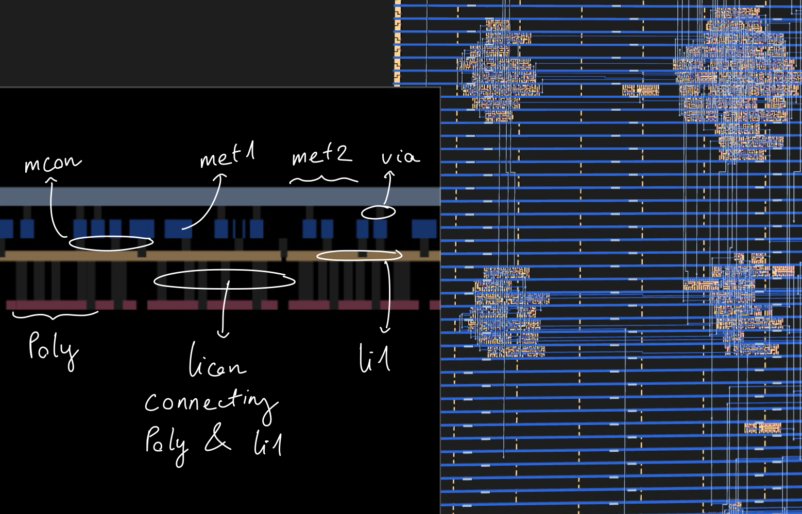
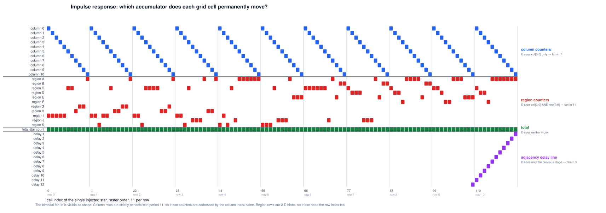
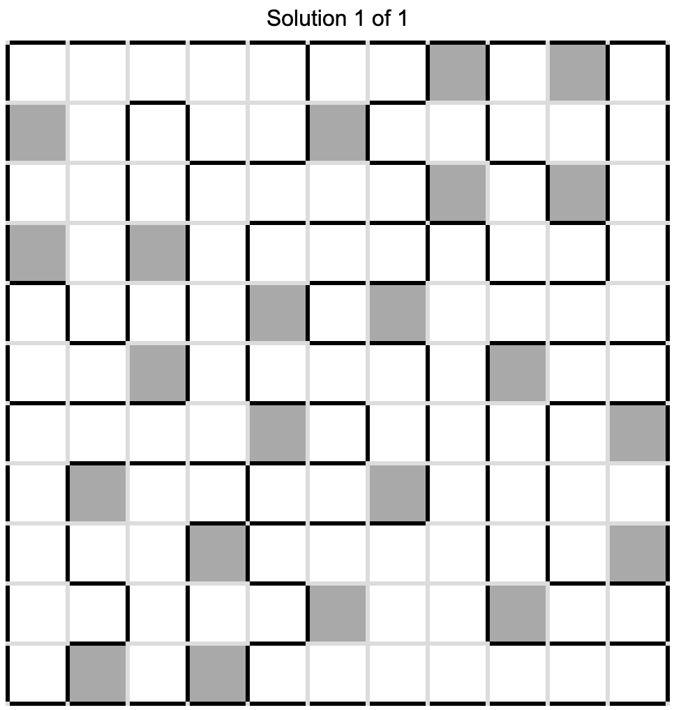
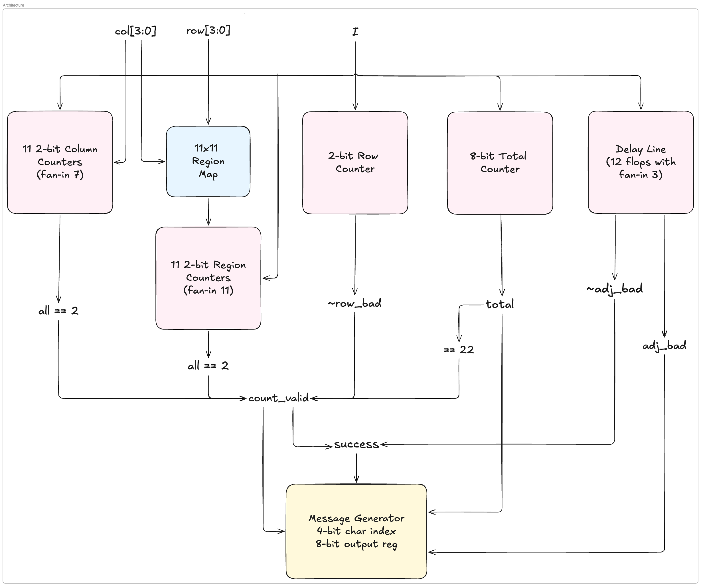
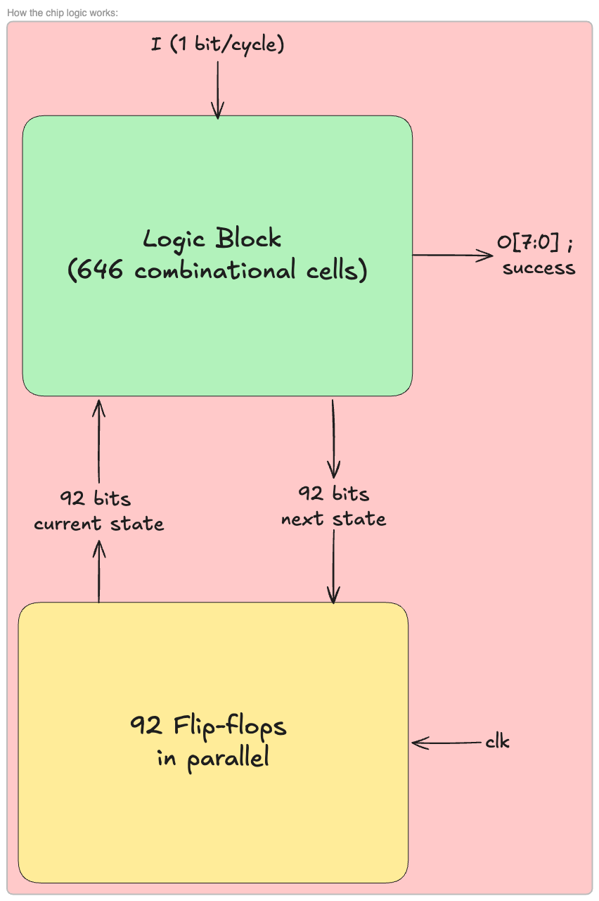
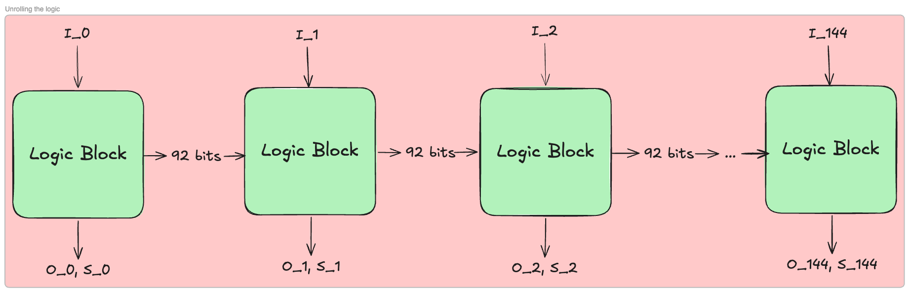
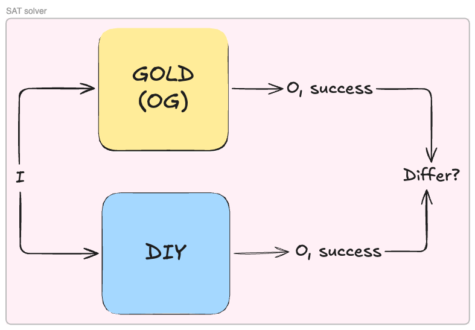
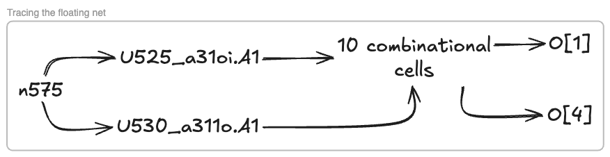
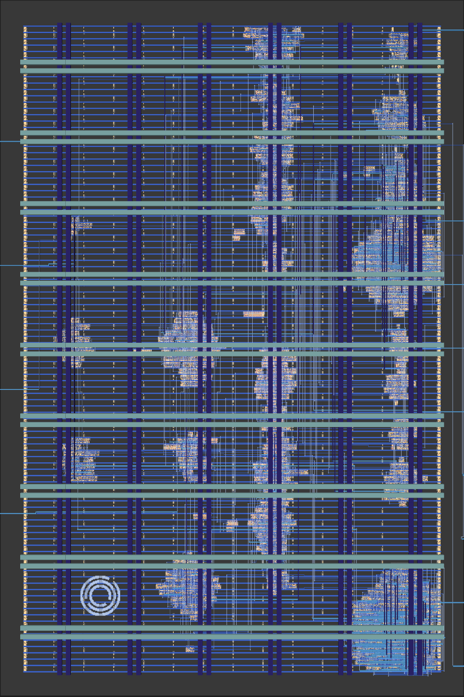
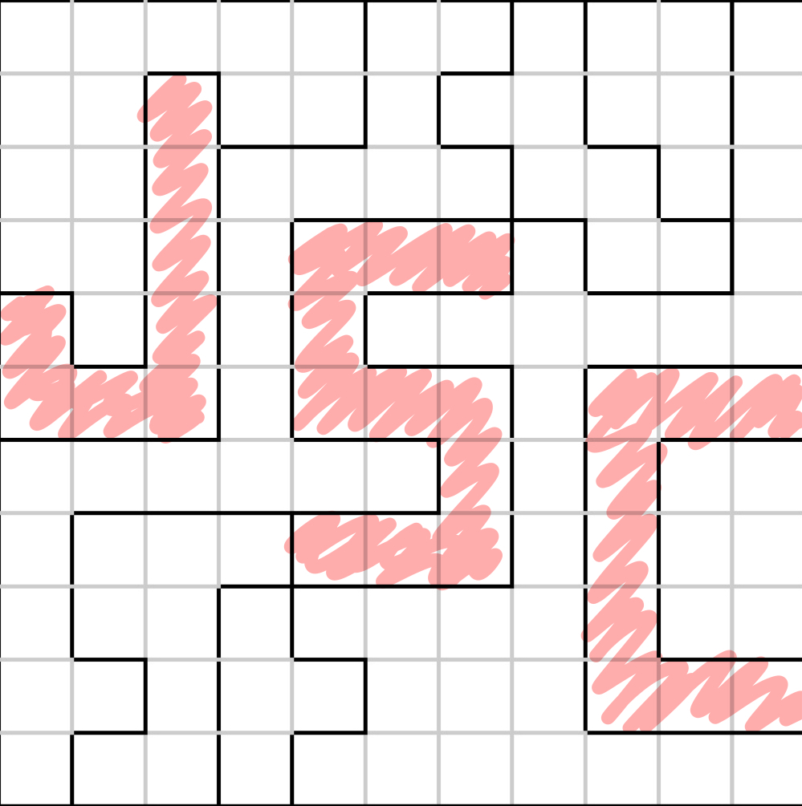

# Reverse-Engineering Jane Street's 2026 ASIC Puzzle

This is my first time solving a Jane Street puzzle. I picked this specifically since it's reverse engineering an ASIC, and I'm a wannabe hardware engineer.

The problem: Jane Street provides us with a GDS file, the final file we send to a foundry to get our chip taped out. Our mission is to derive the purpose of the chip based on the layout and polygons.

This writeup shows how the chip was cracked.

## TL;DR

- **The puzzle**: an 11×11 Star Battle validator, synthesised to a real sky130 ASIC and shipped as raw layout. No RTL, no schematic, no netlist.
- **The method**: write a GDSII parser and connectivity extractor from scratch, validate it against ground truth Jane Street themselves shipped, recover a 738-gate netlist, simulate it, and then measure the architecture out of it.
- **The proof**: rebuild the chip forwards from the recovered architecture, from RTL, synthesis, PnR, to GDS, showing the rebuild is bit-identical to the original.
- **The eggs**: The Jane Street logos across the chips & the Star Battle Grid, a Morse message on a fake layer below the die, and a message encoded inside the waveform.

## 1. What We Are Given

The package contains:

```
puzzle.gds            the chip. 1.4 MB of geometry.
example_inputs.vcd    the waveform: some stimulus, and what the chip did with it.
warmup/               a small unrelated design, showing the whole chip design flow.
```

The warm-up which looks like a tutorial is actually an oracle, a design whose GDS & correct netlist we have so we can run our extractor on the warm-up, diff the result against the answer, and validate the scripts. Everything downstream rests on this. 

### What a GDS actually contains

A GDSII file is a flat stream of binary records describing shapes. The ones that matter:

| Record | Meaning |
|---|---|
| `BGNSTR` / `STRNAME` | begin a structure: a reusable cell definition |
| `BOUNDARY` + `LAYER` + `XY` | a filled polygon on a layer |
| `PATH` + `WIDTH` + `XY` | a centreline with a width, or a wire |
| `SREF` + `SNAME` + `XY` | place an instance of another structure here |

Two things follow.

First, hierarchy is by reference: the top structure `puzzle` contains
9,875 `SREF`s pointing at cell definitions, so to get absolute geometry we flatten the tree, composing transforms as we go. 

Second, a wire and a via are geometry. "Net" is not stored anywhere. Electrical connectivity is an emergent property of overlapping shapes, and we have to recompute it.

The layer number alone is not enough either. A layer/datatype pair identifies meaning.
`(67,20)` is local-interconnect metal, `(67,44)` is a contact cut through it, `(67,16)` is a pin marker, `(67,5)` is a text label. Same layer number but four different meanings.

Before running anything, we have to check if the cell names survive.

```
structures: 81
sample names: sky130_fd_sc_hd__nand2_2, sky130_fd_sc_hd__dfrtp_2, VIA_M1M2_PR, INTERNAL_7 ...
```

They did, and that is enormous. 

For example, `sky130_fd_sc_hd__nand2_2` decodes as: SkyWater 130 nm
process, foundry standard cell, high-density variant, 2-input NAND, drive strength 2. A standard cell is a pre-designed logic tile the foundry ships as fixed geometry, we just instantiate them instead of drawing them from scratch. With the names intact, identifying what each blob of polygons now becomes a lookup.

Had they been stripped, the job would have been transistor-level recognition where we have to  pull diffusion and poly geometry, find where they cross (each crossing is a transistor) group those into gates by topology, and match against a library, which I don't think I'd be able to do any of that.

## 2. From polygons to a netlist

### Parsing

GDSII is a record of `[length][type][payload]`. I wrote my own rather than installing `gdstk`, partly because the local Python had a broken `pyexpat` that made `pip` unreliable, mostly because owning the parser means knowing exactly what is being
silently dropped (I did create a `venv` with `gdstk` to compare between the library and the DIY parser and it matched perfectly).

### Connectivity

The physical rule is simple: two conductors are the same net if they touch.

1. Collect every conducting rectangle, local interconnect and metals 1 through 5, and flatten them to absolute coordinates.
2. Union-find: same layer, overlapping or abutting => same net.
3. Cut layers bridge vertically. A contact unions the shapes it overlaps on the layer below and the layer above.

Two details decide whether this works at all:

- **Exclude `licon`.** That cut layer contacts poly and diffusion, the transistors
  themselves. Bridge through it and every cell shorts through its own internals, collapsing the chip into one net. Include the metal vias; exclude the one that reaches down to
  silicon.
  
- **Extract every conducting layer from inside cells, not just local interconnect.** Most sky130 cells expose their pins on li1, but some (flip-flops and XORs among them) bring a pin up to metal-1 internally, and the router simply lands there. Pulling only li1 leaves those pins unreachable.

This is where the warm-up came to clutch. It diff named the broken net and
the count of fragments in one step, helping me fix the parser.

### Cell function

Since the sky130 PDK is open source, the official behavioural
models are a fetch away, and each is a small structural netlist of Verilog primitives:

```verilog
and and0 (and0_out , A1, A2      );
or  or0  (or0_out_X, and0_out, B1);
buf buf0 (X        , or0_out_X   );
```

We then parse those primitives, evaluate them topologically, and the cell functions are the vendor's rather than our reading of a naming convention. As a cross-check, 35 of the cells publish a closed-form boolean equation in their header comment, and all 35 agreed with the parsed version.

The three flip-flops use table-driven primitives that are awkward to parse, so they are
hand-coded: a plain D flop, one with asynchronous reset, one with asynchronous set.

### Simulation

With a netlist and cell functions we can simulate. First we split instances into combinational, sequential and physical-only. After that, we topologically sort the combinational cells, then per cycle, apply inputs, evaluate in order, apply the clock edge, update the flops.

I wrote my own rather than using `iverilog` because the endgame needs two things a Verilog simulator makes awkward: read any internal net at any cycle, and drive stimulus
programmatically inside a search loop.

### Is it right?

| Check | Result |
|---|---|
| Placements vs the DEF, including orientation | 230/230 |
| Pin coverage | 291/291 pin-instances located |
| Net-by-net identity vs the DEF | 84/84 |
| Puzzle: drivers per net | 738/739 |
| Puzzle: replay `example_inputs.vcd` | 312/312 cycles bit-exact on all 9 outputs |

The last one is decisive, because it works on the real design where no oracle exists. For passing by accident to happen, the placements, pin geometry, connectivity, cell functions, flop semantics and reset behaviour would all have to be wrong in a mutually cancelling way, across 312 cycles and 9 output bits, including a non-trivial ASCII byte stream. That does not happen here.

The driver count is worth a note. Since the nearest unconnected output is 12.77 µm away, about 30 routing tracks, not a near miss, it is a genuinely floating input in Jane Street's design, not an extraction failure. But it's chill since both its loads sit outside the `success` logic.

### First contact

With a simulator that provably matches the real chip, the obvious next move is to poke it and see what happens. Two boards need no imagination at all, since they are the only ones the input space hands us for free: every bit low, and every bit high.

| Stimulus | `O` as ASCII |
|---|---|
| the provided VCD | `TRY AGAIN` |
| all-zero input | `EMPTY SKY` |
| all-one input | `BIG BANG` |
| random input | `TRY AGAIN` |

`TRY AGAIN` is free information, not `EMPTY SKY` & `BIG BANG` though. We can tell that it's not a fixed ROM, because it emits different strings for different machine states.

Also, sky & big bang? That sounds like a big hint. It reminded me of that [Jane Street's Star Battle Puzzle](https://www.janestreet.com/culture/street-view/numberphile-star-puzzle/) on Numberphile, and I'm going to use that as my main lead.

## 3. Finding the shape before finding the meaning

As the extraction is done and functionally proved, we move to the part with no algorithm: 738 gates with
machine-generated names, and what are their meanings.

To investigate, we have to use 3 different techniques:

**Cone of influence.** Walk backwards from a signal through its driver, that driver's inputs,
their drivers, recursively. Basically trace everything back to its origin.

| Region | Instances | Flops |
|---|---|---|
| `success` cone | 484 | 79 |
| `O[7:0]` cone | 713 | 92 |
| O-only (the output generator) | 229 | 13 |
| success-only | 0 | n/a |

The `success` cone is entirely contained in the `O` cone and nothing is success-only. This confirmed what was stated in the Jane Street's blog: 

>"There is one section of the design that is used to generate the output but does not affect the `success` output."

One-way information flow. Practically, 229 cells can be ignored until the
very end.

**Physical clustering.** Placement is not random. The placer puts cells that talk to each other near each other, because wiring is expensive => proximity is evidence of relatedness.

By bucketing on a 60 µm grid, we can sort the checker on the left and centre of the die and the generator on the right, past about 120 µm. There's also one striking bucket: 118 instances, zero flops, almost entirely in the `success` cone, which could be a comparator, an adder, or a wide decoder.

**Flop dependency graph.** Collapse combinational logic to edges, exposing sequential structure while hiding gate-level noise. Those are the patterns we are looking for:

| Pattern | Meaning |
|---|---|
| long chain, each flop one source | shift register |
| self-loop plus narrow increment logic | counter |
| self-loop plus XOR of a few taps | LFSR |
| dense mutual dependency | state machine/datapath |

Which gave:
- Zero simple chains. Not one flop has exactly one source flop.
- All 92 flops depend on themselves through combinational logic.
- Data-input fan-in widths cluster bimodally at 7 (25 flops) and 11 (22 flops). (7/11 lol. Easter egg worthy?)
- `I` fans out to 45 gates directly.

Looking at the results, my natural first guess for a 1-bit serial input and 92 flops is "shift register, then compare", which is exactly what the warm-up design does. 

But that's not it. Also a serial input touching 45 gates in one cycle doesn't look like a shift-register load. It's more like it's participating in a wide computation every cycle.

My second guess is a "nonlinear cipher-style state being stirred by the input stream and compared against a hidden constant," which almost sold the investigation.

## 4. The Verification

The method I used to validate was **Pertubation**: Reset, run the chip with `I = 0` for `N` cycles (I used 140. The goal is just to investigate the flops' states throughout the cycles). Call that the baseline. Then, for each cycle `k`, reset and run the same stimulus except with `I = 1` at cycle `k` alone. Then compare the results:

| Hypothesis | Prediction |
|---|---|
| nonlinear digest | one bit flip diverges to roughly half the state within a few cycles and stays diverged |
| structured checker | one bit permanently perturbs only the accumulators that cell feeds |

The result:

```
k= 0  hd=[5,5,5,5,5,5,5,5,5,5] ... final= 3  changed={22, 55, 73}
k= 1  hd=[5,5,5,5,5,5,5,5,5,4] ... final= 3  changed={ 6, 55, 73}
k= 2  hd=[5,5,5,5,5,5,5,5,4,4] ... final= 3  changed={20, 55, 73}
...
k= 9  hd=[5,4,4,4,4,4,4,4,4,4] ... final= 3  changed={ 8, 55, 71}
k=10  hd=[4,4,4,4,4,4,4,4,4,4] ... final= 3  changed={ 9, 26, 55}
k=11  hd=[5,5,5,5,5,5,5,5,5,5] ... final= 3  changed={22, 55, 73}   <= identical to k=0
k=12  hd=[5,5,5,5,5,5,5,5,5,4] ... final= 3  changed={ 6, 55, 73}   <= identical to k=1
```



1. Maximum divergence is 5 flops out of 79, settling to 3 => Not nonlinear digest
2. Exactly three flops change permanently, one of which changes for every `k`: 2 per-position accumulators, and one global counter (flop 55 always changes).
3. `k = 11` reproduces `k = 0` & `k = 12` reproduces `k = 1` exactly => Period of 11

A serial input whose effect depends only on `k mod 11` is a raster scan. From this we can infer that the bit stream is a 2-D array read row-by-row, eleven cells per row => 11x11 grid, 121 cells with read row-major with the column advancing fastest.

Combined with the `EMPTY SKY` hint above, we can almost certainly tell that this is a Star Battle Puzzle. Our final task is to solve this grid with a validity condition.

## 5. Reading the machine

Remember the bimodal cluster of 7 and 11? This is where it comes into play:

```
column accumulator, bit 0 :  {own_bit_0, own_bit_1, step, col[3:0]}             =  7
region accumulator, bit 0 :  {own_bit_0, own_bit_1, step, col[3:0], row[3:0]}   = 11
delay-line stage          :  {previous stage, itself, step}                     =  3
```

- own_bit_0: the flop's own Q fed back
- own_bit_1: another flop in the same 2-bit counter (for counting the stars)
- col[3:0] & row[3:0]: cover the 11x11 grid
- column accumulator: we need a separate accumulator since the design is row-major, and we can't check and reset a column after 1 visit
- region accumulator: same idea

That is the entire content of the bimodality that looked so cryptographic. Not two cipher banks, but two banks of counters addressed by different indices. The self-feedback is a counter holding its value. The arithmetic is `+1`.

The count is now clean:
- 2 flops wired together => 2 bits
- 22 flops with width 11: 11 regions x 2 bits
- 22 flops with width 7: 11 columns x 2 bits
- 2 flops with width 7: row-star counters (passed col[3:0] inside too => detects when the row end to check the number of stars)
- 1 flop with width 7: a bit of the total-star counter (coincidence, found after solving everything)

Fit the bimodal cluster count perfectly.

Note: If everything seems too abstract for now, just jump straight to section 8 for a quick sneak peek of the architecture.

### Reading the region map straight off the silicon

As everything is layout-ed perfectly, solving it becomes easy. The region
partition can be read directly, by 121 simulations, one per cell, with no inference at all:

```
for each (r, c) in the 11x11 grid:
    run the chip with a single star at (r, c)
    record which region flop differs from baseline at the end
    that flop's identity IS the region label of (r, c)
```

The answer:

```
    I I I I I C C H G G A          region  size
    I I K I I C H H G G A            A      28
    I I K C C C C H H G A            B       6
    I I K C J J J A H H A            C      21
    K I K C J A A A A A A            D       8
    K K K C J J J A E E E            E       9
    C C C C C C J A E B B            F       4
    C D D D J J J A E B B            G       5
    C D D F A A A A E B B            H       7
    C C D F F A A A E E E            I      14
    C D D F A A A A A A A            J      11
                                     K       8
```

Feeding it into a Star Battle generator, we got this:


We can all see it right? I know, but I'm going to save it for the easter egg section.

### The adjacency window

Next, we have 12 flops with fan-in 3. It is a 12-deep delay line, and we can trace the stage order from reading "which cell leaves a trace in which flop".

The sticky flag next to it taps exactly four stages: delays 1, 10, 11 and 12. And when we lay those out on the grid:

```
         c-1    c    c+1
  r-1     12    11    10      <- cells already scanned, this many cycles ago
  r        1     *
```

Delay 1 is the cell to the left. Delay 11 is directly above, one full row back. Delays 12 and 10 are the two diagonals above. Only four of the eight neighbours, because adjacency is symmetric and a raster visits every pair exactly once, so checking the four already-seen neighbours of each cell covers all eight-way pairs across the whole grid. 

And that is why the flag's fan-in also includes the
column counter: at column 0 the "left" and "up-left" neighbours are on the previous row and must be masked out, and at column 10 the "up-right" one wraps.

## 6. Solving it

Feed it into a Star Battle Solver, we have the solution:



Then we flatten row-major into 121 bits, drive them into the extracted netlist from a cold reset:

```
cycle 120 : last cell consumed
cycle 121 : success = 1, and stays 1
cycle 121+: O emits  40 42 32 84 87 79 32 83 84 65 82 83 32 42 41
                 =   (  *  _  T  W  O  _  S  T  A  R  S  _  *  )
```

We got `(* TWO STARS *)`, another message.

## 7. Proving it rather than believing it

| Test | Count | Result |
|---|---|---|
| single-star relocations (move one star to any free cell) | 2,178 | all rejected |
| rectangle swaps | 189 | all rejected |
| random 22-star placements | 200 | all rejected |
| placement breaking only adjacency | exists | rejected |
| placement breaking only the region rule | exists | rejected |

All three rules are independently enforced in silicon, and none is a coincidence of the
unique solution.

## 8. Building it back

Now that we have a full understanding of the chip, we're going to rebuild everything, from RTL to GDS.



As for the verification, we create the golden vectors from simulating the extracted netlist. This step ensures that the testbench won't just only encodes our expectations, hiding other edge cases.

18,943 cycles across 119 scenarios: the vendor waveform, the solution, the empty board, 25 relocations, 25 rectangle swaps, 25 random placements, `enable` stalls mid-grid, `enable` dropping mid-message, misaligned grids, back-to-back attempts, and reset asserted at every character position of an in-flight message.

| Device under test | Result |
|---|---|
| RTL | bit-exact, 18,943 cycles |
| after synthesis to sky130 gates | bit-exact |
| after place-and-route | bit-exact |

| | original | rebuild |
|---|---|---|
| standard cells | 738 | 758 |
| flip-flops | 92 | 84 |
| standard-cell area | 8,417 µm² | 6,466 µm² |
| die | 60,000 µm² (200 × 300) | 17,237 µm² |
| utilisation | 14.0% | 49.2% |

More cells but less area. 51 of my 758 cells are timing-repair buffers and 29 are clock buffers, none of which is like the OG. Since I didn't know Jane Street's target, I just constrained a 12 ns clock. Their clock tree is a single `clkbuf_16` feeding two levels while mine is sized to a constraint. Take those 80 buffers out and the remaining logic is smaller than theirs => where the area goes.

Also the die difference is for the easter eggs' area. It's just a floorplanning thing, not logic-related.

Splitting both designs by when each flop moves gives an exact accounting:

| | original | rebuild |
|---|---:|---:|
| checker state | 78 | 78 |
| message sequencer | 6 | 6 |
| output byte register | 8 | 0 |
| total | 92 | 84 |

The checker and the sequencer match flop for flop. The sequencer is a 4-bit character index plus two control flags in both, the only difference being that the original's index has no reset at all, the four `dfxtp` that are the only reset-less flops on the die.

Moreover, the OG circuit registers its output byte, which I didn't implement here. Eight flops, one per bit: four `dfstp` (set on reset) driving `O[0]`, `O[2]`, `O[5]`, `O[7]`, and four `dfrtp` driving the rest. I just drive all eight combinationally off the character index.

However, closing the gap is rather straightforward once the structure is known. I just need to decode the next index and register the byte, which keeps `O` cycle-identical while matching the original's shape. It is bit-exact on all 18,943 vectors, passes the same equivalence proofs, and synthesises to 91 flops. The 92nd is `O[7]`, which is 0 for every character of all five messages, so `yosys` just folds it away and the original's flow did not.

And it closes as a real chip, not just a netlist that simulates:

| Signoff, LibreLane 3.0.9 / sky130A / 12 ns | Result |
|---|---|
| DRC (magic, KLayout, router) | 0 / 0 / 0 |
| LVS | 0 |
| antenna violations | 0 |
| setup, all 9 corners | closed, worst +0.137 ns (`max_ss_100C_1v60`) |
| hold, worst | +0.028 ns |
| max slew | 115 pins, slow corner only, worst 0.98 ns against the PDK's own 1.5 ns limit |

### What building it back found

Rebuilding the chip was actually the right step. It revealed the one message that the original blackbox-probing method had missed, and completes the set:

| rows | cols | regions | adjacency | message |
|:---:|:---:|:---:|:---:|---|
| ✓ | ✓ | ✓ | ✓ | `(* TWO STARS *)` |
| ✓ | ✓ | ✓ | ✗ | `TWO"NOT TOUCH` |
| no stars at all | | | | `EMPTY SKY` |
| every cell a star | | | | `BIG BANG` |
| anything else | | | | `TRY AGAIN` |

`TWO"NOT TOUCH` is the one probing never produced. It needs a placement that is correct in every count and wrong only in adjacency, especially when we hadn't solved the puzzle before probing. Reading the logic hands it over immediately.

It also settles what the chip is for. This is a diagnostic, not simply a pass/fail. If all three counting rules are satisfied and the only thing wrong is that two stars touch, it says so specifically.

## 9. Proving it

Bit-exact agreement over 18,943 cycles is a lot of evidence. However, we can always take it further. And to make sure that we cover all the boards, let's start formally verify the circuit.

### A demonstration first

Before any equivalence argument, one experiment that shows what the machinery does.

I gave a SAT solver the extracted netlist and exactly one constraint, `success == 1`. No
region map, no puzzle rules, no hint about what the chip is for. Nothing in the problem
statement knows what Star Battle is.

```
$ yosys ... sat -seq 127 -set-init-zero -set-at 127 win 1 -dump_vcd solve.vcd
   127  \win                                          1
Dumping SAT model to VCD file reimpl/out/solve.vcd
```

1.8 seconds. It returned a 121-bit board carrying exactly 22 stars, and that board is the
Star Battle solution, identical to our solution. Replaying it through
the simulator gives `(* TWO STARS *)`.

We just proved that the whole puzzle can therefore be solved with no knowledge of the puzzle by asking the silicon what would satisfy it.

### Turning a circuit into a formula

A SAT solver takes a boolean formula and answers one of two things. Either here is an assignment that makes it true, or no such assignment exists. And to do that, we're going to unroll the entire circuit, strip its sequential logic & time elements out of the way. A boolean variable is true or false, permanently. It cannot be 0 on cycle `N` and 1 on
cycle `M`.

The chip as extracted is 738 cells: 92 flip-flops and 646 combinational gates. Those 92 flops are not a chain with logic between them. They are a single 92-bit register, every bit updating on the same edge, with the whole combinational block wrapped around it in feedback:



Unrolling makes one copy of that combinational block per clock cycle, and wires copy `C`'s next-state output straight into copy `C+1`'s current-state input:



Now the flip-flops are gone. No clock, no memory and no feedback. Just one enormous block of combinational logic, which converts to a formula mechanically, a variable per wire and a few clauses per gate.

145 is a window I chose rather than a property of the design. It includes 4 cycles of reset, 121 grid cells, and 20 for the message. It's also the reason the method is bounded. If anything goes wrong on cycle 146, we wouldn't know. But let's assume 145 is safe for now.

Note: only the 145 bits of the input pin are free. Every other variable in the
formula, including all 92 state bits at all 145 cycles, is derived. Once the inputs are
fixed the gates force everything else.

### How does it cover all boards literally?

The inputs go into the formula as symbols and are never assigned a value. The question is not "what happens for this board" but "does a board exist that makes the two designs differ". `UNSAT` means no such board exists, established by deduction over the structure of the formula.

For example: suppose the formula contains `a AND b = 1` together with
`NOT a = 1`. The first forces `a = 1`, the second forces `a = 0` => contradiction. And `b` was never assigned. Because `b` was never touched, that single step covers both of its values at once.

Scale that up. When the solver reaches a contradiction having committed to `N` of the 145 input bits, it retires every sequence agreeing on those `N` regardless of the other `145 - N`. That is $2^{145-N}$ input sequences eliminated in one step. By using reasoning instead of looping through $2^{145}$ possible boards, we can iterate through each logical board in seconds.

### The miter



Firstly, it compares outputs only. Even though my own implementation is different from the original (according to the flops & netlist after running RTL-to-GDS), none of that is compared or required to agree. 

### What the proof found

The first run failed, with a counterexample pointing at `U525_a31oi.A1`, the floating net from section 2. This is expected since a floating net can take any input it likes, which directly influence the output (not `success` though). Tracing the net forward
through the netlist:



The floating net can move two bits of the output byte, and reaches neither `success` nor any flip-flop. Touching no state, it cannot influence a later cycle either. Pinning it to 0, the value that reproduces the vendor's own waveform, and everything goes
through:

| Claim | Window | Result |
|---|---|---|
| `success` agrees, for every possible board | 145 cycles, a whole attempt | proved, 4 s |
| `success` agrees for any value the floating net takes | 145 cycles | proved, 4 s |
| `O` && `success` agree, for every possible board | 145 cycles, the whole attempt including every character of the longest message | proved, 5 min |
| `O` && `success` agree under arbitrary stalls and mid-stream resets | 100 cycles | proved, 13 s |
| the same, across the full 145-cycle window | 145 cycles | no result after 30 min |

Row one is the one that matters for the puzzle: for all $2^{121}$ boards, the recovered design and the original agree on the win condition. It takes four seconds, because comparing only `success` drops the entire message generator out of the cone and the solver never has to consider it.

Row three is the strongest statement in this writeup. Every output byte, on every board, across a complete attempt. 2,049,750 variables and 5,359,575 clauses, and it is worth noting that this instance was intractable earlier in the project: it only became solvable once the counters in my rebuild were fixed to saturate like the original's, which gave the solver far more internal structure to match up.

The last row is the honest limit. Leaving `enable` and `rst_n` free as well, so the solver may stall the scan or reset it anywhere, is proved over 100 cycles but does not finish over 145. So arbitrary stall and reset patterns are covered through the verdict and the opening bytes, and the tail of the message under those conditions rests on the 18,943 simulated cycles instead. Everything on a clean run is proved outright.

## 10. The Easter Eggs

### The Jane Street Logo

This is quite obvious since we only need to open a GDS viewer to see it. The same one appears in the warmup GDS file.




### Star Battle Grid

The regions form 3 letters: JSC => Jane Street Capital



### Verilog Attribute

The solution, `(* TWO STARS *)` is Verilog attribute syntax. Not sure if it's an easter egg, but it's cool that the winning message is wrapped inside the language the chip was written in.

### Perfect Number

Remember how the warm-up's job is comparing a sum against a constant? They could've chosen any constant, but instead Jane Street chose `comparator496`, the third perfect number.

### Morse code, below the die

Two structures, `INTERNAL_3` and `INTERNAL_7`, are each a single rectangle on layer `200/0`, not a real sky130 layer, so nothing in the fabrication flow ever looks at them.
They differ only in width:

| Structure | Size | Stamps |
|---|---|---|
| `INTERNAL_3` | 1380 × 2720 | 21 |
| `INTERNAL_7` | 4140 × 2720 | 15 |

4140 is exactly 3 × 1380, and all 36 placements sit at the same y, forming a single horizontal line 52.7 µm below the die outline. (The height, 2720, is the standard cell row height, so the marks are one cell-row tall.)

Two element widths in a 1:3 ratio on a line is either a barcode or Morse. Measuring the gaps reveals that they take three values, 1, 3 and 7 units, which is exactly Morse spacing: intra-character, inter-character, inter-word. A barcode has no 7.

```
# ### ### #   #   # ### #       # ###   # ### #   #   ### #   # ###   ### ###
        # ###   ### # #         # ###   # # #   ###   # ### #   # ###

.--. . .-.  /  .- .-. . -. .- --  /  .- -..  /  .- ... - .-. .-
 P   E  R        A  R  E  N  A  M      A  D      A  S  T  R  A
```

`PER ARENAM AD ASTRA`, or "through the arena to the stars". A pun on `per aspera ad astra`
("through hardships to the stars"). Arena here can mean the grid we playing the Star Battle on, and also, in Latin, it refers to a sandy place, and silicon is sand. Tuff word play.

### A message in the sample stimulus

This one might be the trickiest one, and it's in `example_inputs.vcd`, the sample waveform the puzzle ships alongside the GDS.

The file's `$date` reads `Sat Dec 31 23:59:60 2016`, a real UTC leap second. This can stand on its own as another easter egg.

Its `$version` field shows "Leave no stone unturned! But for this file,
consider looking at it in a waveform viewer instead." It seems like it's telling us to read the stimulus instead of just replaying them through the netlist just to get `TRY AGAIN` twice.

So we folded the `I` stream into the same 11-wide raster that gave us the region map, and

```
attempt 1 (columns 0-10):  4  3  5  4  3 10  9  0  0  0  0    total 38
attempt 2 (columns 0-10):  7  3  2  3  4 11  8  0  0  0  0    total 38
```

First of all, 38 stars on a 11x11 grid? Those are not real attempts to solve the board, hinting at something else. Secondly, columns 7-10 are identically zero across all 22 rows of both attempts.


It's obviously telling us to only read the first 7 bits. And when we read those bits as a byte, column 0 as the LSB up to column 6 as the MSB, and every one of the 22 rows decodes cleanly to printable ASCII, we have this:

```
attempt 1                                   attempt 2
row 0  0010101 -> 1010100 = 0x54 'T'        row 0  1101011 -> 1101011 = 0x6b 'k'
row 1  0001011 -> 1101000 = 0x68 'h'        row 1  1001111 -> 1111001 = 0x79 'y'
row 2  1010011 -> 1100101 = 0x65 'e'        row 2  0000010 -> 0100000 = 0x20 ' '
row 3  0000010 -> 0100000 = 0x20 ' '        row 3  1000011 -> 1100001 = 0x61 'a'
row 4  0111011 -> 1101110 = 0x6e 'n'        row 4  1110111 -> 1110111 = 0x77 'w'
row 5  1001011 -> 1101001 = 0x69 'i'        row 5  1000011 -> 1100001 = 0x61 'a'
row 6  1110011 -> 1100111 = 0x67 'g'        row 6  1001011 -> 1101001 = 0x69 'i'
row 7  0001011 -> 1101000 = 0x68 'h'        row 7  0010111 -> 1110100 = 0x74 't'
row 8  0010111 -> 1110100 = 0x74 't'        row 8  1100111 -> 1110011 = 0x73 's'
row 9  0000010 -> 0100000 = 0x20 ' '        row 9  0000010 -> 0100000 = 0x20 ' '
row10  1100111 -> 1110011 = 0x73 's'        row10  0000010 -> 0100000 = 0x20 ' '
```

> The night sky awaits

As expected from Jane Street. Such sophisticated eggs.

## 11. Reproducing the test

I'll post the entire codebase after the submission finishes.